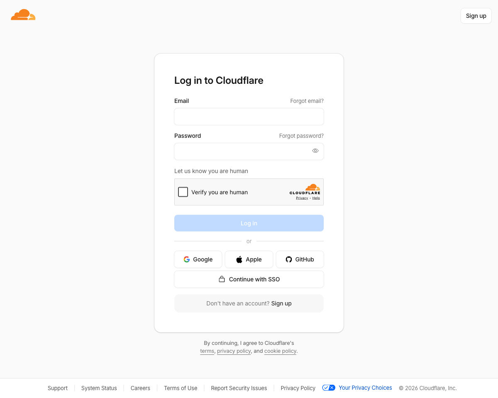

Cloudflare Pages is a JAMstack platform that builds and hosts static sites globally
across Cloudflare's network. The free tier covers unlimited sites, 500 builds per month,
and unlimited bandwidth — more than enough for a personal tutorial site.

## Prerequisites

- Your site repository pushed to GitHub (public or private)
- A Cloudflare account — sign up at [cloudflare.com](https://cloudflare.com) if you don't have one

## Step 1 — Push your repo to GitHub

Cloudflare Pages deploys directly from a Git branch. If you haven't already pushed
your code, create a new repository on GitHub and push:

```bash
git remote add origin https://github.com/YOUR_USERNAME/YOUR_REPO.git
git push -u origin main
```

<div className="callout callout-tip">
  <span className="callout-title">Private repos work too</span>
  <p>
    You can connect a private GitHub repository. Cloudflare will request read-only
    access to the specific repo during setup.
  </p>
</div>

## Step 2 — Log in to Cloudflare

Go to [dash.cloudflare.com](https://dash.cloudflare.com) and sign in.
If you're new, the sign-up form is on the same page.



## Step 3 — Open Workers & Pages

In the left sidebar, click **Workers & Pages**, then click the **Create** button
in the top-right corner of the page.

On the next screen, select the **Pages** tab, then click **Connect to Git**.

## Step 4 — Connect GitHub

Cloudflare will ask you to authorize access to your GitHub account. Click
**Connect GitHub**, then either grant access to **All repositories** or select
your specific tutorial repo.

Once authorized, your repositories appear in a searchable list. Select the repo
and click **Begin setup**.

## Step 5 — Configure the build

The build settings page has two required fields. Fill them in exactly as shown:

| Field | Value |
|---|---|
| **Build command** | `npm run build` |
| **Build output directory** | `dist` |

Then expand **Environment variables** and add one entry:

| Variable | Value |
|---|---|
| `NODE_VERSION` | `22` |

<div className="callout callout-tip">
  <span className="callout-title">Why set NODE_VERSION?</span>
  <p>
    Cloudflare Pages defaults to an older Node.js release. This site requires
    Node 18+ for Astro v6. Setting <code>NODE_VERSION=22</code> pins the build
    to Node 22 LTS, which Cloudflare Pages fully supports.
  </p>
</div>

Leave all other settings at their defaults, then click **Save and Deploy**.

## Step 6 — Watch the build

Cloudflare starts a build immediately. The build log streams in real time — you'll
see it install dependencies, run `astro build`, and then run `pagefind --site dist`
to generate the search index.

A successful build ends with output like:

```
Finished in X.XXX seconds
Build complete. Your site is live at https://YOUR_PROJECT.pages.dev
```

The whole process typically takes under a minute.

## Step 7 — Visit your site

Click the generated `*.pages.dev` URL. Your site is now live on Cloudflare's global
CDN. Every subsequent push to your `main` branch triggers a new build and deploy
automatically — no manual steps required.

<div className="callout callout-tip">
  <span className="callout-title">Preview deployments</span>
  <p>
    Pushes to any branch <em>other than</em> your production branch create a separate
    preview URL (e.g. <code>feat-new-tutorial.YOUR_PROJECT.pages.dev</code>). This
    lets you review changes before merging to main.
  </p>
</div>

## Optional — Add a custom domain

If you own a domain, you can serve your site from it instead of the generated
`*.pages.dev` URL:

1. In your Pages project, go to **Custom domains** → **Set up a custom domain**
2. Enter your domain (e.g. `tutorials.example.com`)
3. Cloudflare will add the required DNS record automatically if your domain is
   already on Cloudflare, or give you a CNAME record to add at your registrar

SSL is provisioned automatically — no certificate management required.

## What gets deployed

The `npm run build` script runs two commands:

```
astro build       → generates static HTML/CSS/JS into dist/
pagefind          → builds the full-text search index into dist/pagefind/
```

Both outputs land in `dist/`, which is what Cloudflare Pages serves. Search works
on the live site because the Pagefind index files are included in the deployment.
